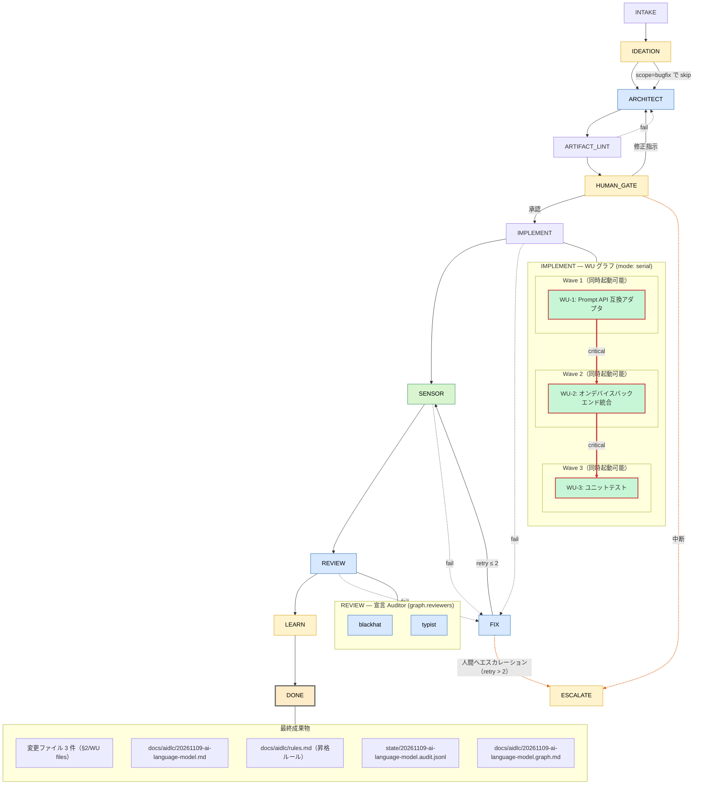

```mermaid
flowchart TD
  intake["INTAKE"]
  ideation["IDEATION"]
  architect["ARCHITECT"]
  artifact_lint["ARTIFACT_LINT"]
  gate_design["HUMAN_GATE"]
  implement["IMPLEMENT"]
  sensor["SENSOR"]
  review["REVIEW"]
  learn["LEARN"]
  fix["FIX"]
  escalate["ESCALATE"]
  done["DONE"]
  subgraph IMPLEMENT_SG["IMPLEMENT — WU グラフ (mode: serial)"]
    direction TB
    subgraph WAVE_1["Wave 1（同時起動可能）"]
      direction TB
      WU_1["WU-1: Prompt API 互換アダプタ"]:::critical
    end
    subgraph WAVE_2["Wave 2（同時起動可能）"]
      direction TB
      WU_2["WU-2: オンデバイスバックエンド統合"]:::critical
    end
    subgraph WAVE_3["Wave 3（同時起動可能）"]
      direction TB
      WU_3["WU-3: ユニットテスト"]:::critical
    end
  end
  subgraph REVIEW_SG["REVIEW — 宣言 Auditor (graph.reviewers)"]
    direction TB
    reviewer_blackhat["blackhat"]
    reviewer_typist["typist"]
  end
  subgraph DELIV["最終成果物"]
    direction TB
    D1["変更ファイル 3 件（§2/WU files）"]
    D2["docs/aidlc/20261109-ai-language-model.md"]
    D3["docs/aidlc/rules.md（昇格ルール）"]
    D4["state/20261109-ai-language-model.audit.jsonl"]
    D5["docs/aidlc/20261109-ai-language-model.graph.md"]
  end
  intake --> ideation
  ideation --> architect
  ideation -->|"scope=bugfix で skip"| architect
  architect --> artifact_lint
  artifact_lint --> gate_design
  artifact_lint -.->|"fail"| architect
  gate_design -->|"承認"| implement
  gate_design -->|"修正指示"| architect
  gate_design -.->|"中断"| escalate
  implement --> sensor
  implement -.->|"fail"| fix
  sensor --> review
  sensor -.->|"fail"| fix
  review --> learn
  review -.->|"fail"| fix
  fix -->|"retry ≤ 2"| sensor
  learn --> done
  fix -.->|"人間へエスカレーション（retry > 2）"| escalate
  WU_1 -->|"critical"| WU_2
  WU_2 -->|"critical"| WU_3
  implement --- IMPLEMENT_SG
  review --- REVIEW_SG
  done --- DELIV
  linkStyle 8 stroke:#dd6b20,stroke-width:2px
  linkStyle 17 stroke:#dd6b20,stroke-width:2px
  linkStyle 18 stroke:#c53030,stroke-width:3px
  linkStyle 19 stroke:#c53030,stroke-width:3px
  classDef hitl fill:#fff3cd,stroke:#d4a017,color:#000
  classDef agent fill:#d7e8ff,stroke:#2b6cb0,color:#000
  classDef sensor fill:#d8f5d0,stroke:#2f855a,color:#000
  classDef terminal fill:#e2e2e2,stroke:#666,color:#000
  classDef critical stroke:#c53030,stroke-width:2px
  classDef done fill:#c6f6d5
  classDef failed fill:#fed7d7
  classDef current fill:#feebc8,stroke-width:3px
  class ideation,gate_design,learn,escalate hitl
  class architect,review,fix,reviewer_blackhat,reviewer_typist agent
  class sensor sensor
  class done terminal
  class done current
  class WU_1,WU_2,WU_3 done
```
